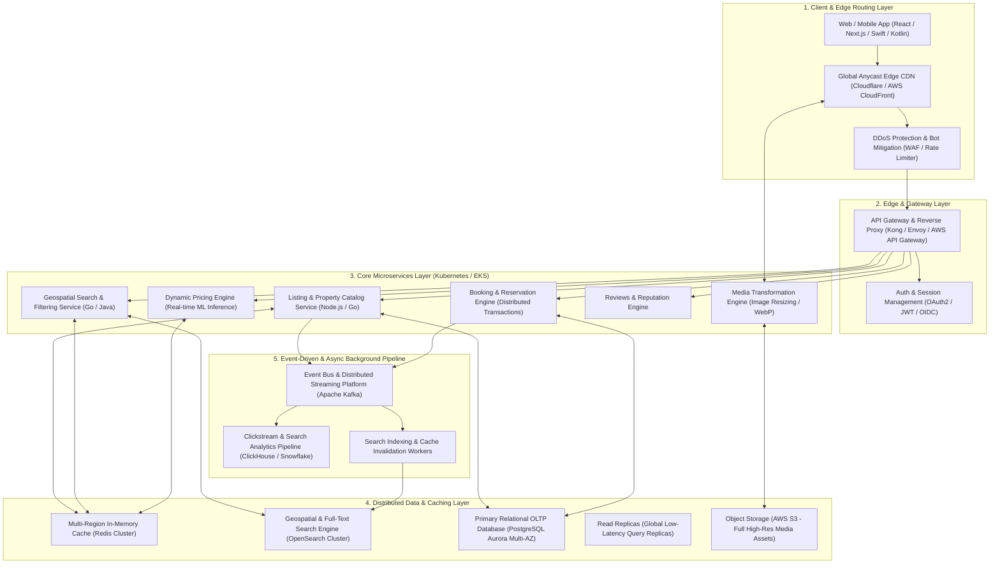

# High-Level Architecture Diagram & System Design: Production Vacation-Rental Marketplace (Airbnb-Scale)

This document presents a production-grade architecture diagram and technical scaling strategy for an Airbnb-scale global vacation rental platform servicing tens of millions of concurrent users, listings, reservations, and real-time availability lookups.

---

## 1. High-Level Architecture Diagram (Mermaid)

---

## 2. Scaling Strategy across System Pillars

### A. Frontend & Edge Strategy
- **Edge Caching & Static Asset Acceleration**: Static shell bundles, CSS/JS, and property hero images are served from distributed Anycast Edge CDN nodes with `< 15ms` Time-To-First-Byte (TTFB).
- **On-the-Fly Media Transformation**: Property images uploaded by hosts are processed via an Edge Image Service (`MediaService`) into responsive modern formats (`WebP`, `AVIF`) with pre-calculated image srcsets (`sm`, `md`, `lg`, `xl`).

### B. Search & Geospatial Indexing Strategy
- **Low-Latency Geospatial Queries**: Searching across millions of properties within a map bounding box is handled by an **OpenSearch / Elasticsearch Cluster** using H3/S2 spatial indexing and R-tree geometric filters.
- **Cache-First Search Architecture**: High-frequency search queries (e.g., "Goa, India · Weekend stays") hit a distributed **Redis Cluster** populated with pre-warmed search result cards.

### C. Booking & Transactional Consistency
- **ACID Reservation Engine**: Double-booking prevention is enforced via distributed pessimistic locking or optimistic concurrency control (`SELECT ... FOR UPDATE` in PostgreSQL Aurora Multi-AZ) paired with idempotent booking tokens.
- **State Machine Engine**: Reservations progress through strict states (`HELD` → `CONFIRMED` → `PAID` → `COMPLETED`) via saga patterns.

### D. Async Event-Driven Indexing
- When a host updates a listing or a guest completes a booking, the service emits domain events (`ListingUpdated`, `DateBooked`) to **Apache Kafka**.
- Dedicated background consumer workers (`SyncWorkers`) immediately update the search index (`OpenSearch`) and invalidate affected regional Redis keys asynchronously without blocking user-facing API response times.
